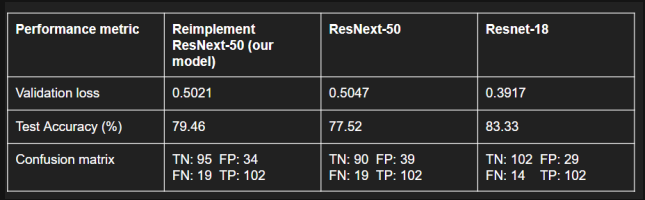

# ResNext-Reimplementation

This project is UTAR **UCCD3074 Deep Learning For Data Science** assignment. It is the reimplementation of ResNext-50 tested on pikachu dataset for binary image classification.

Pikachu dataset contains image that was web scraping from the internet using Azure Bing Web Search API. Visit [Here (To Kaggle)](https://www.kaggle.com/hal0samuel/pikachu-classification-dataset) for more information.

### Result
	

--------------------
#### Notes

- The models directory is not able to upload to repository due to the file size is too big, use link:
https://drive.google.com/drive/folders/13O0dE4QRiHCzvWlP2BX9ACmet5DjQZKV?usp=sharing

- Put the models folder in the project root directory

- Include only latest trained model is included to avoid the project file size going too big

- Use Application.ipynb to use the pretrained model and read the previous training statistics

- CIFAR10_ResNext_Deep_Learning.ipynb is the file for training CIFAR10 dataset

- Pikachu_ResNext_Deep_Learning.ipynb is the file for training Pikachu dataset

- models directory store all the pretrained model according to epoch, the .json file in the directory store the stats for previous training

- runs directory is for TensorBoard used

- pikachu dataset directory consists of pikachu binary classification image

- CIFAR10 test is incomplete and deprecated
